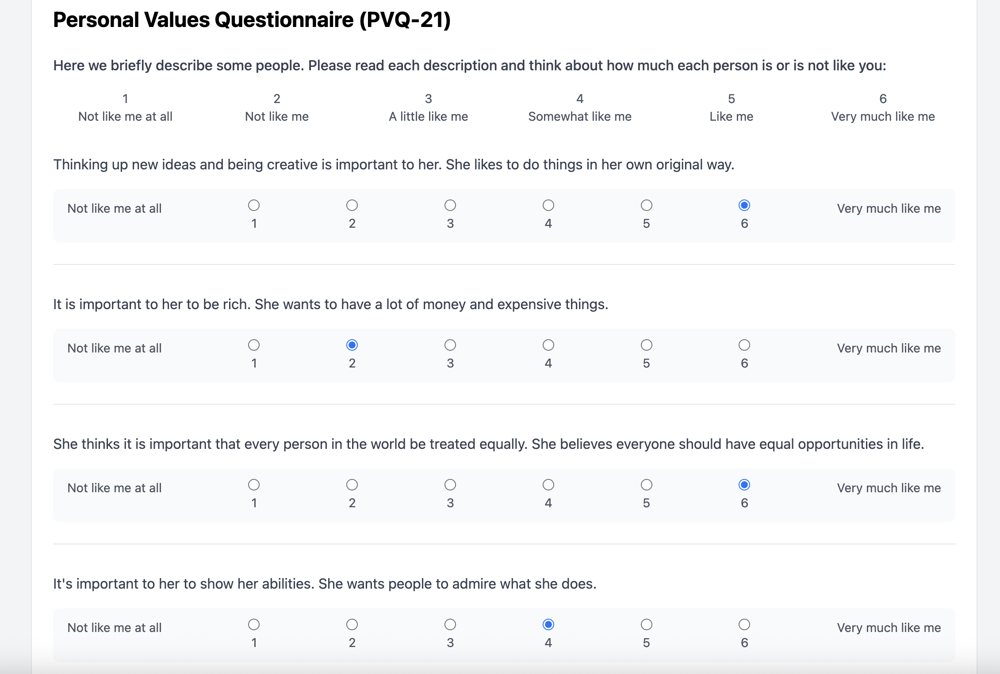
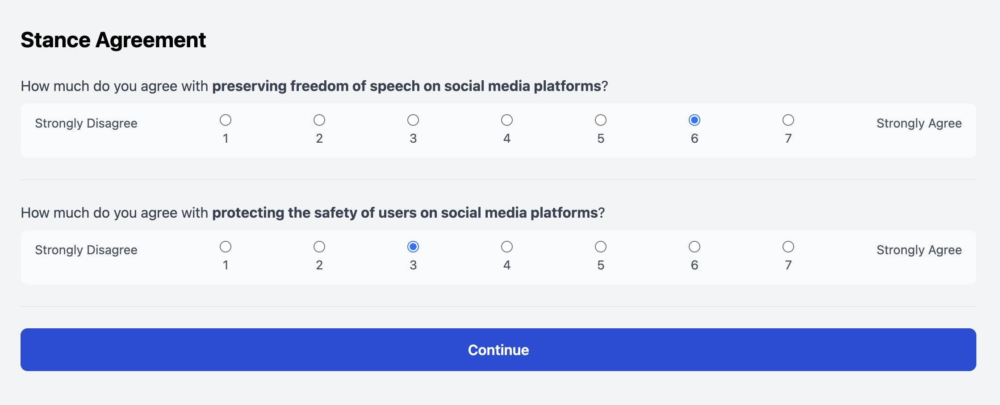
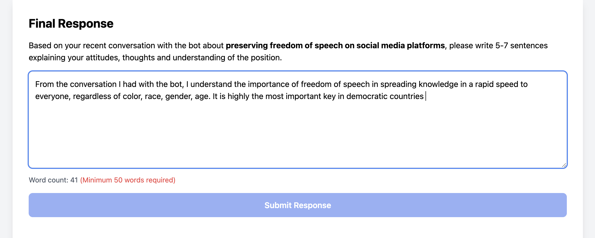

# AI-driven linguistic alignment - Study Platform

This repository contains the full source code for a web-based experimental platform I developed to study how AI personalities influence human argumentation and social values.

I built this application to run a 2x2 factorial study involving real-time interactions between human participants and custom-prompted AI agents.

## Project Overview

The core of this project is a React application that guides participants through a complex experimental flow: screening, demographic surveys, a timed chat intervention with an AI, and cognitive tasks.

Unlike standard survey tools (like Qualtrics), this study required a custom-built solution to handle:
1.  **Real-time AI integration:** Integrating OpenAI's GPT-4 with dynamic system prompts based on experimental conditions.
2.  **State Management:** Tracking participant progress through 13+ distinct stages (consent, pre-tests, chat, post-tests).
3.  **Data Integrity:** Custom attention checks and bot detection mechanisms.


## Application Screenshots

### The Participant Experience
The application guides users through a structured flow designed to minimize order effects and maximize engagement.
Example of two surveys:
| **1. Value Assessment (PVQ)** | **2. Stance Assignment** |
|:---:|:---:|
|  |  |
| *Counterbalanced value surveys* | *Post conversation agreement* |

| **3. AI Chat Intervention** | **4. Essay & Reflection** |
|:---:|:---:|
|  |  |
| *Real-time, timed discussion with AI* | *Post-chat argumentative essay* |

### Cognitive Tasks & Administration

| **5. Alternative Uses Task** | **6. Researcher Dashboard** |
|:---:|:---:|
|  |  |
| *Creativity assessment (AUT)* | *Live session tracking and export* |


## The Tech Stack

* **Frontend:** React (Vite), Tailwind CSS
* **Backend:** Node.js, Express
* **Database:** MongoDB (Mongoose)
* **AI Integration:** OpenAI API (GPT-4), Google Gemini (configured for testing)

## Key Technical Features

### 1. Dynamic AI "Personalities"
The central manipulation of the study required the AI to adopt specific personas ("Creative" vs. "Conservative").
* I implemented a configuration system (`botConfig.js`) that injects specific vocabulary constraints into the system prompt.
* Depending on the assigned condition, the app dynamically constructs the prompt to ensure the AI uses specific word lists (e.g., "pioneering" for Creative, "principled" for Conservative) while maintaining a conversational flow.

### 2. Experimental Rigor & Counterbalancing
To ensure methodological validity, I wrote logic to handle randomization and counterbalancing:
* **Condition Assignment:** The backend tracks the number of participants in each condition to ensure even distribution across the 4 groups.
* **Questionnaire Ordering:** The app randomizes the order of the value surveys (PVQ-21 and SBSVS) to prevent order effects.

### 3. Quality Control
Since the study was distributed via Prolific, filtering out bots and inattentive participants was critical.
* **Bot Detection:** I implemented a custom "Math CAPTCHA" and tracked window focus/blur events to detect if participants left the experiment tab.
* **Attention Checks:** The flow includes specific questions designed to filter out participants who aren't reading instructions carefully.

## Project Structure

* `/src/components`: Reusable UI components for the different questionnaires (PVQ21, AttitudeSurvey) and the chat interface.
* `/src/config`: Contains the prompt engineering logic (`botConfig.js`) and word lists.
* `server.js`: The Express server handling API requests, session management, and database connections.

## Setup and Installation

1.  Clone the repo:
    ```bash
    git clone [repository-url]
    ```

2.  Install dependencies:
    ```bash
    npm install
    ```

3.  Create a `.env` file with the following keys:
    * `MONGODB_URI`
    * `OPENAI_API_KEY`
    * `ADMIN_USERNAME` / `ADMIN_PASSWORD` (for the researcher dashboard)

4.  Run the development server:
    ```bash
    npm run dev
    ```

## Status
This code was used for data collection in a study currently in preparation for publication. The experimental design is based on Schwartz’s Theory of Basic Human Values.

---
*Created by Naama Rozen*
